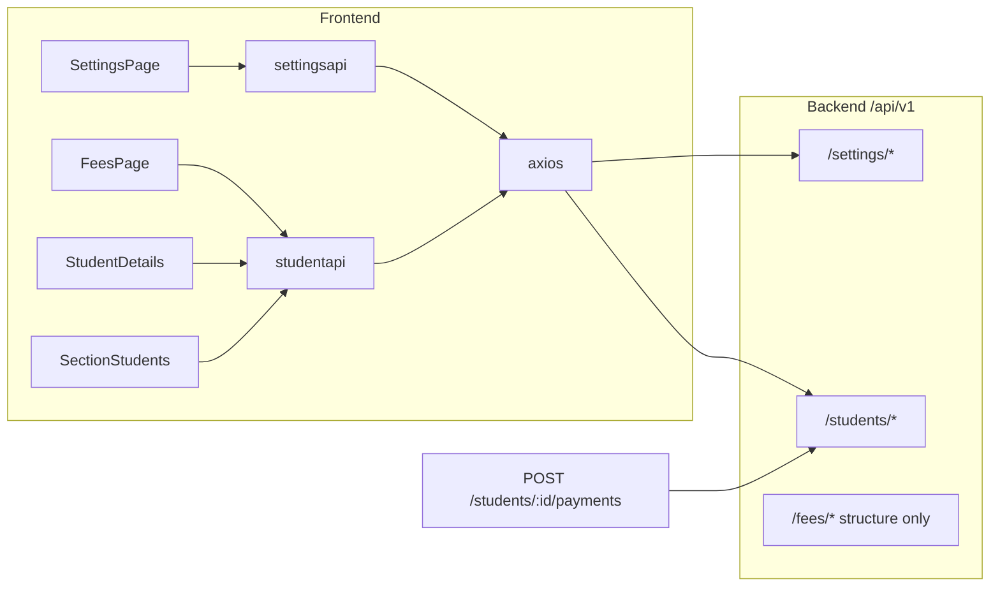

# FeeGo: Settings APIs, Payments, and Photo Upload

## Current architecture (relevant parts)



- **Payments** are recorded only via [`POST /api/v1/students/:studentId/payments`](Backend/src/modules/students/students.routes.js) — not the fees module.
- **Settings** routes are registered correctly in [`Backend/app.js`](Backend/app.js) at `/api/v1/settings`.
- **ImageKit** auth: `GET /api/v1/students/imagekit-auth` using `IMAGEKIT_PUBLIC_KEY` / `IMAGEKIT_PRIVATE_KEY` in [`Backend/src/cors/config/env.js`](Backend/src/cors/config/env.js). Browser uploads directly to ImageKit (no SDK). Add-student already works in [`Frontend/src/pages/studentspage.jsx`](Frontend/src/pages/studentspage.jsx); profile edit does not.

---

## 1. Why settings page APIs appear broken

| Issue | Impact | Fix |
|-------|--------|-----|
| **No `VITE_BASE_URL` in repo** | Frontend calls `undefined/settings/...` | Add [`Frontend/.env.example`](Frontend/.env.example) with `VITE_BASE_URL=http://localhost:8000/api/v1` (must include `/api/v1`) |
| **All-or-nothing load** | [`settingspages.jsx`](Frontend/src/pages/settingspages.jsx) `refreshData` uses `Promise.all` for profile + **fees structure** + academic years + preferences — any failure shows *"Settings could not be loaded"* even when settings APIs are fine | Load settings endpoints independently; show partial UI + per-section errors; keep fee structure as optional secondary load |
| **Circular import** | [`settings.service.js`](Backend/src/modules/settings/settings.service.js) imports `bulkPromoteStudentsService` from students; [`students.service.js`](Backend/src/modules/students/students.service.js) imports settings helpers — can break academic-year/promotion at runtime | Break cycle: move shared academic-year helpers to e.g. `Backend/src/cors/utils/academicYear.js` or use **dynamic `import()`** inside `createAcademicYearService` only when promoting |
| **Zod errors → 500** | Settings controllers call `.parse()` without mapping Zod to 400 | Add small `parseBody(schema, body)` helper or try/catch in controllers (match pattern used elsewhere if any) |
| **Missing env docs** | [`Backend/.env.sample`](Backend/.env.sample) omits ImageKit + `DATABASE_URL` | Extend sample with `IMAGEKIT_PUBLIC_KEY`, `IMAGEKIT_PRIVATE_KEY`, `VITE_BASE_URL` note |

**Verification:** After env fix, hit `GET http://localhost:8000/api/v1/settings/profile` and confirm Network tab on Settings shows 200 for `/settings/*` even if `/fees/structure` fails.

---

## 2. Payment button on student tables (classes flow + fees)

### What exists today

| Page | Student table | Payment UI |
|------|---------------|------------|
| **Fees** [`feespage.jsx`](Frontend/src/pages/feespage.jsx) | Ledger rows | **Working** — `WalletCards` opens `PaymentModal`, uses `dueFees` from `getFeesLedger` |
| **Class → section students** [`studentspage.jsx`](Frontend/src/pages/studentspage.jsx) when `classId` + `sectionId` in route | Table ~line 4432 | **Dead** `MoreVertical` button (no handler) |
| **Global `/students` directory** | `DirectoryStudentsView` ~line 2140 | Dead `MoreVertical` — **out of scope** per your request |

### Planned implementation

1. **Extract shared component** [`Frontend/src/components/payments/RecordPaymentModal.jsx`](Frontend/src/components/payments/RecordPaymentModal.jsx)
   - Consolidate logic from [`feespage.jsx`](Frontend/src/pages/feespage.jsx) `PaymentModal` (payment mode, amount validation, `recordStudentPayment`, optional receipt download).
   - Support two input shapes:
     - **Ledger student:** `{ id, dueFees[] }` (fees page)
     - **Detail fetch:** `studentId` → call `getStudentDetail` on open, map `fees` where `dueAmount > 0`
   - **Reset form when `student` / `studentId` changes** (`useEffect` on props) — fixes fees page stale fee/amount bug.

2. **Class-section students table** ([`studentspage.jsx`](Frontend/src/pages/studentspage.jsx) ~4432)
   - Replace `MoreVertical` with `Wallet` / `WalletCards` icon button (`title="Record payment"`).
   - State: `paymentStudentId` + modal.
   - On save: refresh `getStudentsBySection` list; optional receipt download like fees page.

3. **Fees page** ([`feespage.jsx`](Frontend/src/pages/feespage.jsx))
   - Swap inline `PaymentModal` for shared component (behavior unchanged; fix reset bug).
   - Optionally rename title to **"Record payment"** for consistency.

4. **Scope guard:** Only add payment action when `useParams().classId && sectionId` (class flow). Leave global directory `More` removed or hidden (no payment there).

**No backend change required** for table payments if we fetch `getStudentDetail` per student when opening the modal.

---

## 3. Fix student profile “Record Payment”

**Root cause (high confidence):** In [`studentdetailspage.jsx`](Frontend/src/pages/studentdetailspage.jsx) `PaymentModal.save` (lines 472–504), a **successful** `recordStudentPayment` is followed by receipt download; if receipt fails, the inner `catch` **rethrows**, outer `catch` shows **"Payment could not be recorded"** even though payment was saved.

**Fixes:**

1. **Decouple receipt from payment success**
   - After `recordStudentPayment`, always call `onSaved(result)` and `onClose()`.
   - Receipt failure → non-blocking toast/warning: *"Payment saved; receipt could not be downloaded."*
   - Same pattern in shared `RecordPaymentModal`.

2. **Align with fees page**
   - Add `paymentMode` select (load modes from settings preferences or default `["Cash","UPI",...]`).
   - Pre-fill `amount` with selected fee’s `dueAmount` when fee changes.

3. **UX guard**
   - Disable or hide **Record Payment** when `detail.fees` has no items with `dueAmount > 0` (explain: allocate fees first).

4. **Migrate profile** to shared `RecordPaymentModal` passing `detail` to avoid duplicate logic.

**Verify:** Record payment on profile → DB updated, balances refresh, receipt optional; repeat with receipt endpoint failing (should still show success).

---

## 4. Profile photo: direct upload via ImageKit (no URL fields)

**Current:** [`EditStudentModal`](Frontend/src/pages/studentdetailspage.jsx) lines 386–387 — manual `Photo URL` / `Photo file ID` text inputs.

**Target:** Same UX as add-student in [`studentspage.jsx`](Frontend/src/pages/studentspage.jsx) (`uploadPhoto` + hidden file input + `getImageKitAuth` + `POST https://upload.imagekit.io/api/v1/files/upload` with folder `/feego/students`).

**Changes:**

1. In `EditStudentModal`:
   - Import `getImageKitAuth` from [`studentapi.js`](Frontend/src/lib/api/studentapi.js).
   - Add `photoUploading` state and `uploadPhoto(file)` (copy from students page).
   - Replace URL/fileId inputs with dashed **Choose photo** control + preview (`form.photoUrl`).
   - Keep `photoUrl` / `photoFileId` on save payload to `updateStudent` (unchanged API).

2. **Env / docs**
   - Add to [`Backend/.env.sample`](Backend/.env.sample):
     ```
     IMAGEKIT_PUBLIC_KEY=
     IMAGEKIT_PRIVATE_KEY=
     ```
   - Document in `Frontend/.env.example` that ImageKit upload uses backend auth endpoint (no frontend ImageKit keys).

3. **Optional polish:** User-visible error if `IMAGEKIT_NOT_CONFIGURED` (503 from auth endpoint).

**No new backend upload route** — existing client-side ImageKit flow is correct.

---

## 5. API health checklist (all modules)

After the above, manually verify:

| Area | Endpoint | Page |
|------|----------|------|
| Settings profile | `GET/PATCH /settings/profile` | Settings |
| Settings preferences | `GET/PATCH /settings/preferences` | Settings |
| Academic years | `GET/POST/PATCH /settings/academic-years*` | Settings |
| Fee structure | `GET /fees/structure` | Settings (isolated load) |
| Payments | `POST /students/:id/payments` | Profile, Fees, Class students |
| Receipt | `GET .../receipt.pdf` | After payment |
| ImageKit | `GET /students/imagekit-auth` | Profile edit, Add student |
| Student detail | `GET /students/:id` | Payment modal fetch |

---

## File change summary

| File | Change |
|------|--------|
| `Frontend/.env.example` | New — `VITE_BASE_URL` |
| `Backend/.env.sample` | ImageKit + DB vars |
| `Frontend/src/components/payments/RecordPaymentModal.jsx` | New shared modal |
| `Frontend/src/pages/feespage.jsx` | Use shared modal |
| `Frontend/src/pages/studentdetailspage.jsx` | Shared modal + ImageKit upload in edit |
| `Frontend/src/pages/studentspage.jsx` | Payment button + modal (class route only); remove dead More |
| `Frontend/src/pages/settingspages.jsx` | Resilient data loading |
| `Backend/src/modules/settings/settings.service.js` | Break circular import |
| `Backend/src/modules/settings/settings.controllers.js` | Zod → 400 (optional small util) |

---

## Testing plan

1. Set `VITE_BASE_URL=http://localhost:8000/api/v1` and ImageKit keys in Backend `.env`.
2. **Settings:** Load page with backend running; confirm profile/preferences/academic years render even if fee structure errors.
3. **Class students:** Open `/classes/:classId/sections/:sectionId/students` → payment icon → record partial payment → pending balance updates.
4. **Fees:** Record payment from ledger → switch student → correct fee pre-selected.
5. **Profile:** Record payment with fees allocated → success even if receipt fails; download receipt when settings receipt assets exist.
6. **Photo:** Edit student → upload JPG → save → avatar shows ImageKit URL.
